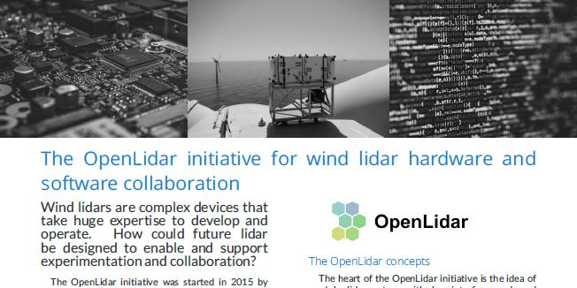

# The OpenLidar initiative for wind lidar hardware and software collaboration
The OpenLidar initiative was started in 2015 by members of IEA Wind Task 32. Its goal is to encourage collaboration around wind lidar hardware and software by developing a modular wind lidar architecture and providing a framework for cooperation.

The opnLidar architecture and modules are documented at [https://github.com/e-WindLidar/OpenLidarModuleDefinitions](Github/e-WindLidar).

To find out more about Task 32 activities, see the Task 32 website at https://community.ieawind.org/task32/home.

# Versions
Please note that this document will be updated regularly. Releases (i.e., stable versions) can be found at https://github.com/IEA-Wind-Task-32/white-paper-openLidar/releases and at https://doi.org/10.5281/zenodo.3414196. 

# How to provide feedback to the roadmap
There are two ways to provide feedback to this document.

## Through Github
You can provide feedback to this document by [raising an issue](https://github.com/IEA-Wind-Task-32/white-paper-openLidar/issues). Before you raise an issue, please take a few minutes to check if there is a similar one in the list already.

**You will have to be logged in to Github to provide feedback**. This means that your feedback will be associated with your username, which may make it possible to identify you. We prefer to have feedback associated with a name because this white paper is a community document.

## Via the IEA Wind Task 32 Operating Agent
Please send your feedback to [ieawind.task32@ifb.uni-stuttgart.de](mailto:ieawind.task32@ifb.uni-stuttgart.de). Please note that your email may be forwarded in its entirety to the rest of the author team. If you need anonymity, please indicate this in your email. Your email should include:
- **Section** What section of the document does this feedback apply to?
- **Issue or challenge:** What is the problem, issue, or challenge?
- **Proposal:** What would you like to see instead?
- **More information:** Where can we get more information? Please provide e.g. a URL.
